# Portal-Beutifier
Make FIT CTDA portal look prettier
### before
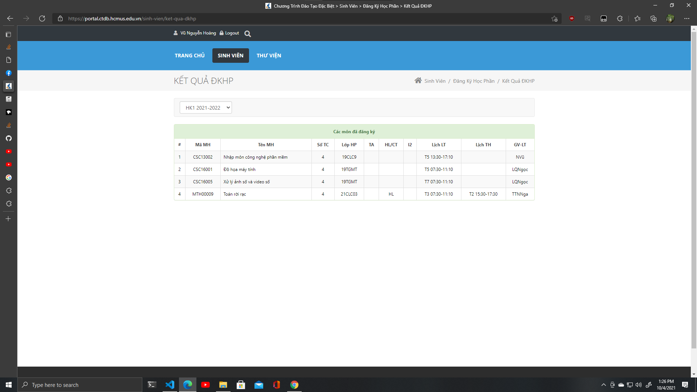

### after
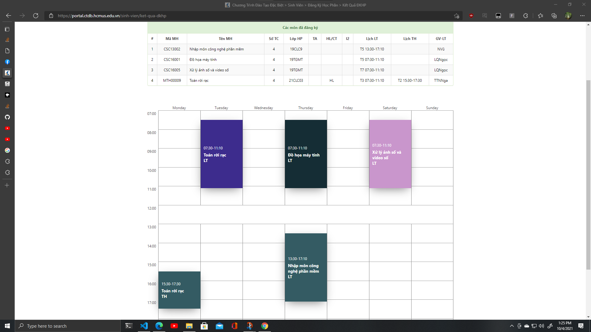
# Download Extension
download as zip
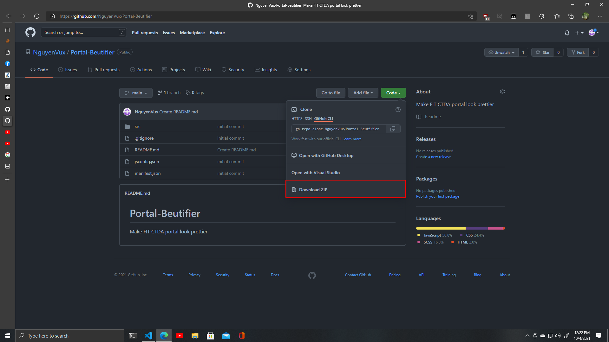
downloaded file
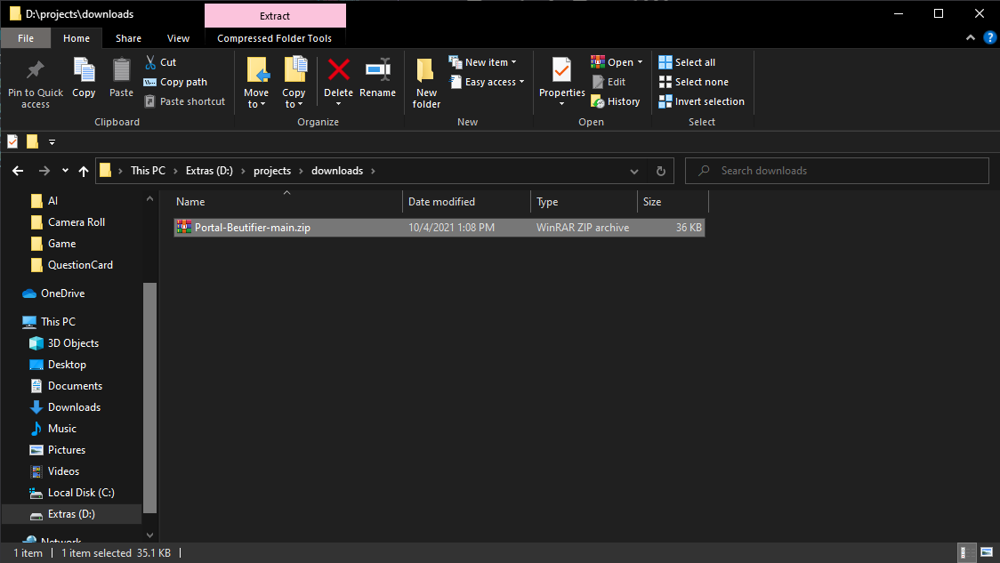
Extract downloaded file
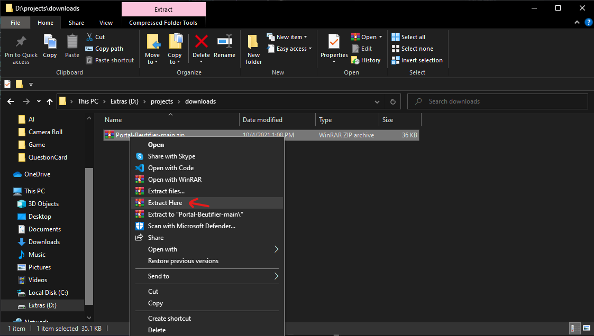
Extension Folder
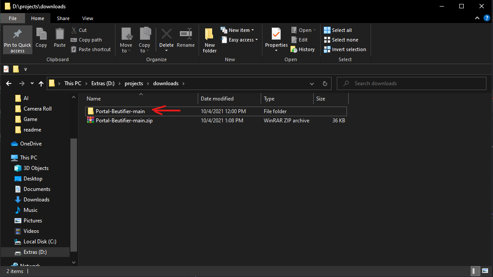

# Installation
## Enable developer mode on browser
### Click the name of the browser you are using
- [Google Chrome](###-Chrome)
- [Microsoft Edge](###-Edge)

### Chrome
### Open this link: [Extension Page](chrome://extensions/)
Enable `developer mode`
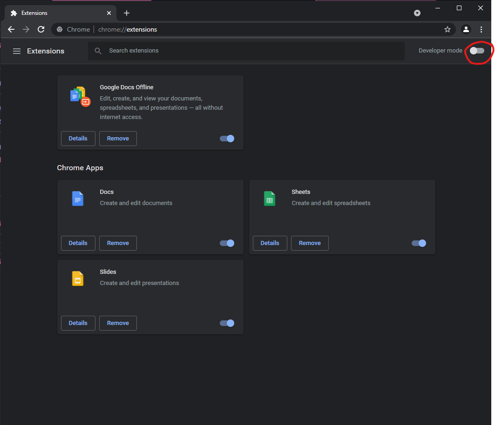
Click here to install extension
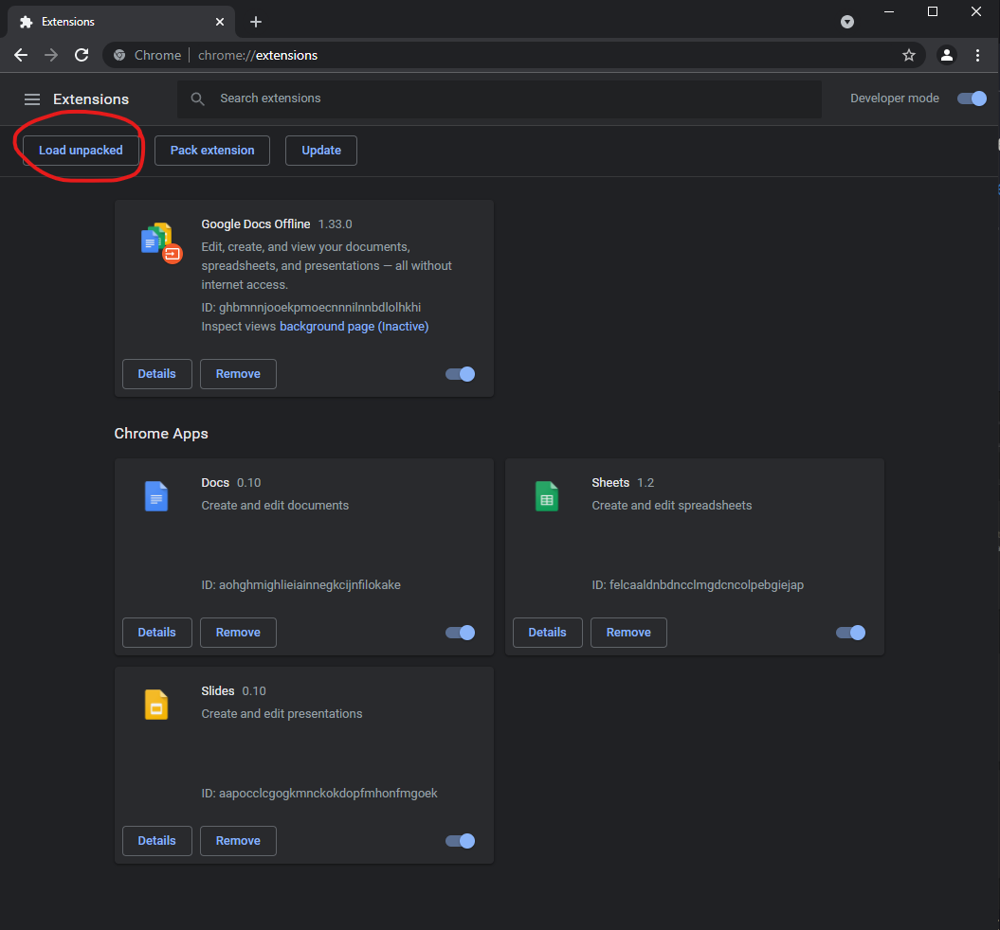
Browse to extracted folder & click `select folder`
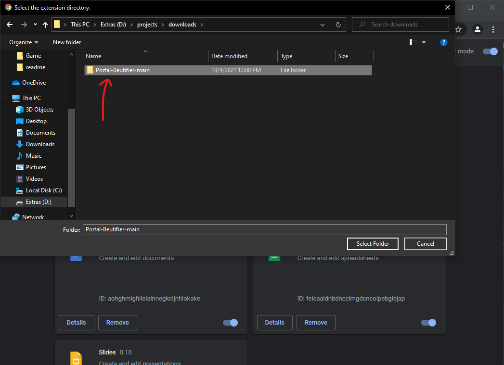
### Edge
### Open this link: [Extension Page](edge://extensions/)
Enable `developer mode`
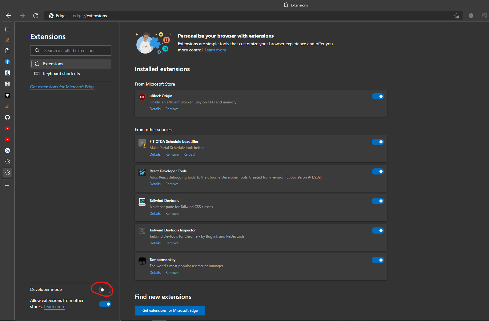
Click here to install extension
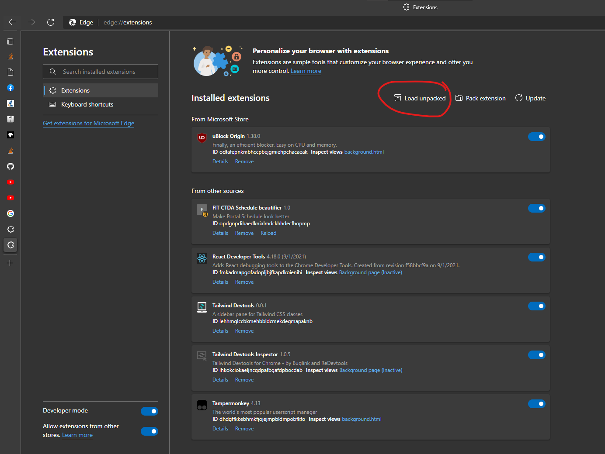
Browse to extracted folder & click `select folder`

